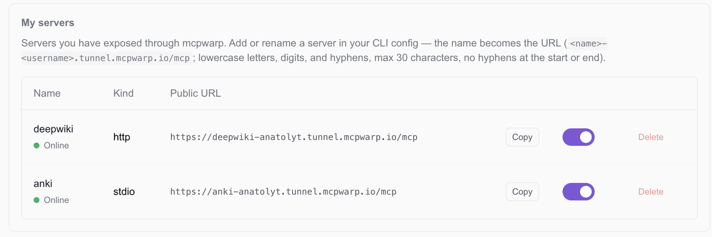

**A request from an LLM client to your public MCP Warp URL passes through the tunnel edge, over a persistent connection, to `mcpwarp up` on your machine, and into your local server — streaming the whole way.**

## Local, remote, or tunneled

A local MCP server runs on your machine, either over stdio or as HTTP on localhost, so only clients running on the same machine, like Claude Desktop or Claude Code, can use it. A remote MCP server runs somewhere public with its own URL and auth: one you deploy and host yourself, or one a vendor hosts for you. A tunneled server, which is what MCP Warp gives you, keeps running on your machine but gets a public URL, so web clients like claude.ai and ChatGPT can reach it too.

## Request path

1. Your MCP client sends an HTTPS request to `https://<name>-<username>.tunnel.mcpwarp.io/mcp`.
2. The MCP Warp edge receives it and verifies the JWT: signature, issuer, expiry, and that the audience matches that specific server's URL.
3. It checks that the token's user is the server's owner, that the account is in good standing, and that the account is within quota.
4. It forwards the request over a persistent WebSocket connection to the machine running `mcpwarp up`.
5. `mcpwarp` forwards the request to the local MCP server — spawned over stdio, or proxied to an HTTP endpoint.
6. The response streams back the same way, edge to client, with backpressure the whole path.

```
LLM client
   │  HTTPS, OAuth bearer token
   ▼
MCP Warp edge              verifies JWT, owner, quota
   │  persistent WebSocket
   ▼
mcpwarp up                 on your machine
   │  stdio or local HTTP
   ▼
Your MCP server
```

## What this buys you

- Your local server never needs to be reachable from the internet directly — only the outbound WebSocket from `mcpwarp up` matters.
- Auth is terminated at the edge, not on your machine — see [Security](/docs/concepts/security/).
- The path is fully streaming, so long-running tool calls and large responses work the same as they would locally.

## The dashboard

The web dashboard at [web.mcpwarp.io](https://web.mcpwarp.io) lists every server you've registered, its public URL, and whether it's online.


