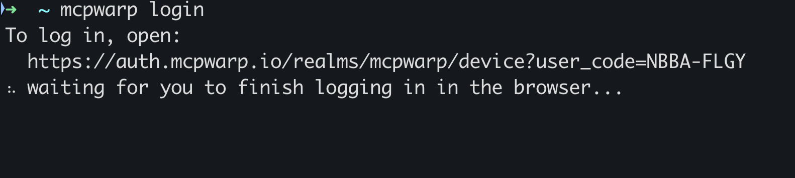
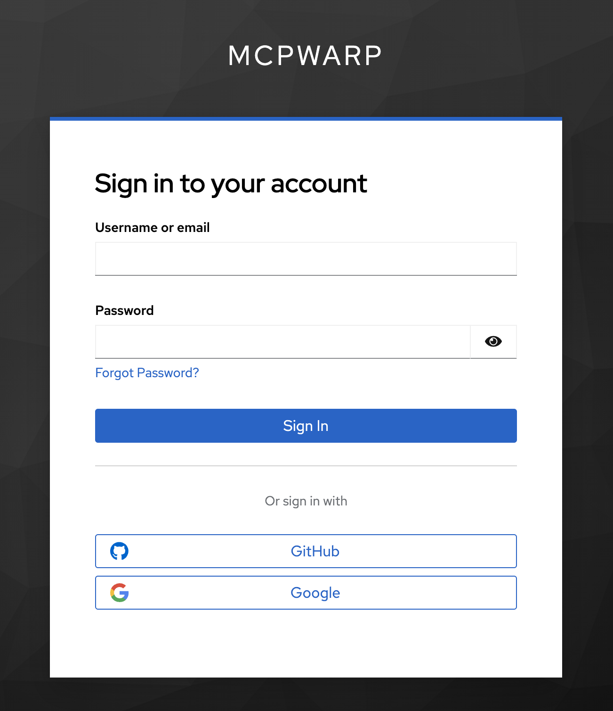
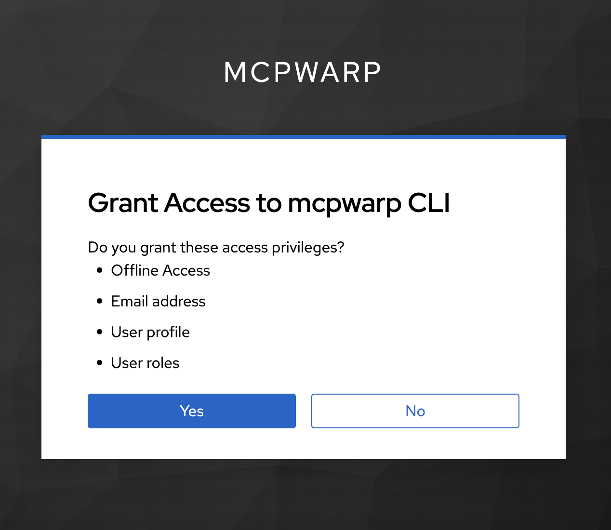
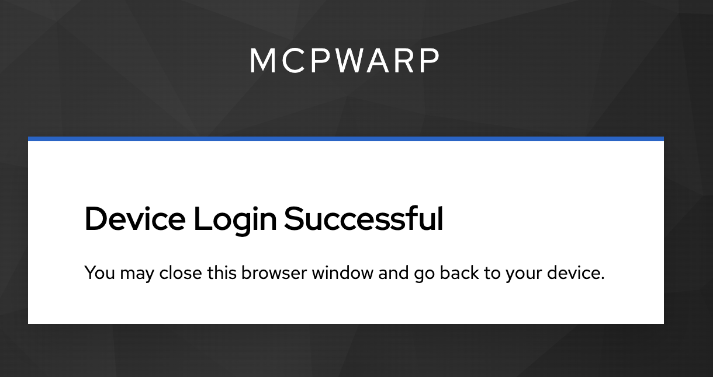
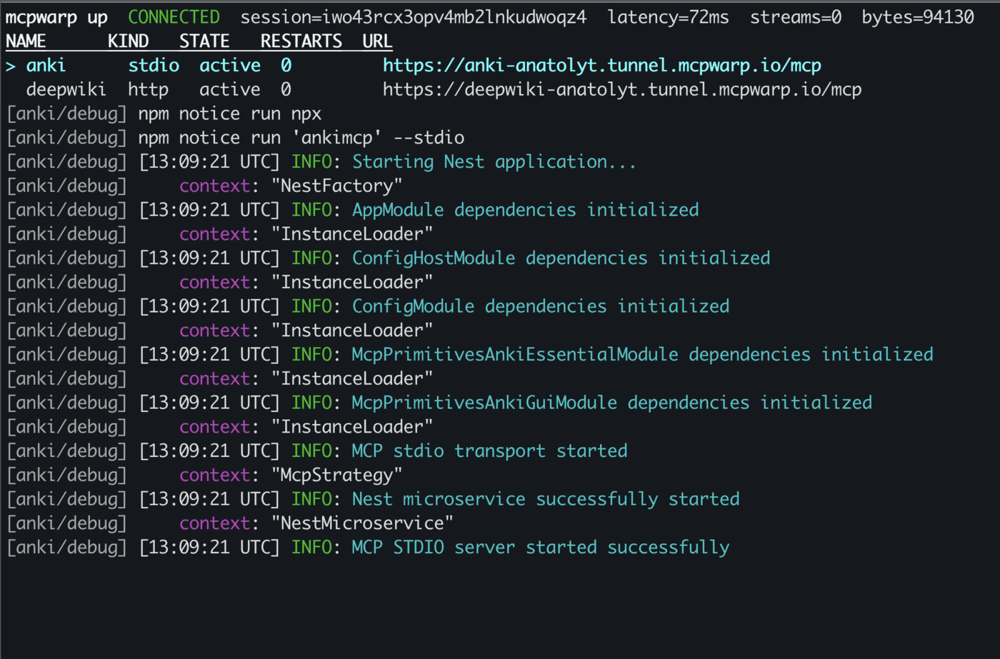
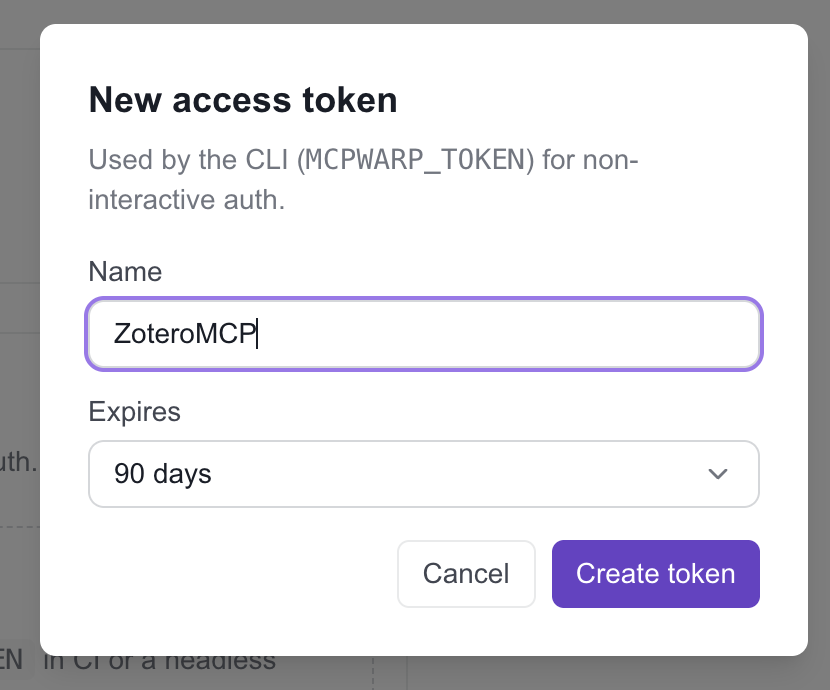
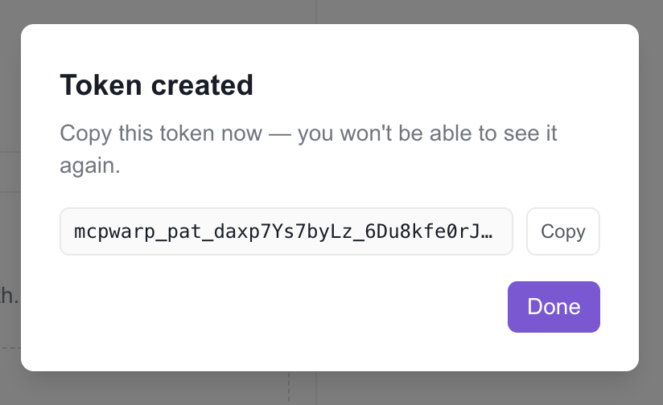

**This page takes you from nothing installed to a public URL for a local MCP server, in about five minutes.**

Sign in at [https://web.mcpwarp.io](https://web.mcpwarp.io) to create your account and choose a username; the CLI login uses the same account.

## Install

MCP Warp is a single static binary, `mcpwarp`. No Node, no npm.

### Homebrew (macOS/Linux)

```sh
brew tap mcpwarp/tap
brew trust --tap mcpwarp/tap   # required once, on Homebrew 6+
brew install --cask mcpwarp
```

Upgrade with `brew upgrade --cask mcpwarp`.

### Scoop (Windows)

```sh
scoop bucket add mcpwarp https://github.com/mcpwarp/scoop-bucket
scoop install mcpwarp
```

Upgrade with `scoop update mcpwarp`.

### Linux packages

Download the `.deb`, `.rpm`, or `.apk` from the [latest release](https://github.com/mcpwarp/cli/releases/latest):

**Debian/Ubuntu**

```sh
sudo apt install ./mcpwarp_*.deb
```

**Fedora/RHEL**

```sh
sudo dnf install ./mcpwarp_*.rpm
```

**Alpine**

```sh
sudo apk add --allow-untrusted mcpwarp_*.apk
```

### Manual install

Download the tar.gz (macOS/Linux) or zip (Windows) for your platform from the [latest release](https://github.com/mcpwarp/cli/releases/latest), and verify against `checksums.txt` (sha256).

macOS binaries are unsigned outside the cask, so remove the quarantine flag once after extracting:

```sh
xattr -d com.apple.quarantine ./mcpwarp
```

## Log in

```sh
mcpwarp login
```

This opens your browser for a device-flow login. If a browser can't be opened (for example, over SSH), pass `--no-browser` and it prints a URL and a code to enter manually:

```sh
mcpwarp login --no-browser
```

The terminal prints the login URL with your code, then the browser walks you through sign-in, granting the CLI access, and a confirmation page:









Credentials are stored per-issuer under `~/.mcpwarp/credentials/`, mode `0600`.

## Configure a server

MCP Warp reads `~/.mcpwarp/config.json` (override with `--config <path>`). Add the server you want to expose:

```json title="~/.mcpwarp/config.json"
{
  "servers": [
    { "name": "notes", "kind": "http", "url": "http://127.0.0.1:8765/mcp" }
  ]
}
```

Use `"kind": "stdio"` instead if you want mcpwarp to spawn the server itself — see [Expose a stdio server](/docs/how-to/expose-a-stdio-server/) and [Expose an HTTP server](/docs/how-to/expose-an-http-server/) for both shapes in full.

Check your config is valid before starting anything:

```sh
mcpwarp status
```

## Start the tunnel

```sh
mcpwarp up
```

`mcpwarp up` connects, registers every configured server, and prints a table of public URLs. It stays in the foreground until you press Ctrl+C. On a terminal (stdin and stdout both a TTY) it runs a full-screen TUI; otherwise, or with `--no-tui`, it prints plain lines instead.

```
NAME     KIND   URL
notes    http   https://notes-anatoly.tunnel.mcpwarp.io/mcp
```

On a TTY it looks like this:



On first `up`, you may see a `USERNAME_REQUIRED` error — sign in once at [web.mcpwarp.io](https://web.mcpwarp.io) to pick a username, then rerun `mcpwarp up`.

## Headless and CI

For scripts, services, or CI, skip the TUI and use a personal access token instead of an interactive login:

```sh
export MCPWARP_TOKEN=mcpwarp_pat_...
mcpwarp up --no-tui
```

Mint a token from the dashboard at [web.mcpwarp.io](https://web.mcpwarp.io) — it's shown once.

Give the token a name and an expiry:





## Paste the URL into a client

Copy the URL from the table (in the TUI, `c` copies the selected row's URL) and add it to your MCP client as a remote MCP server (custom connector / remote server / `mcp.json`, depending on the client). The client will run through an OAuth sign-in the first time it connects.

See [Connect Claude](/docs/how-to/connect-claude/), [Connect ChatGPT](/docs/how-to/connect-chatgpt/), or [Connect other clients](/docs/how-to/connect-other-clients/) for client-specific steps.
