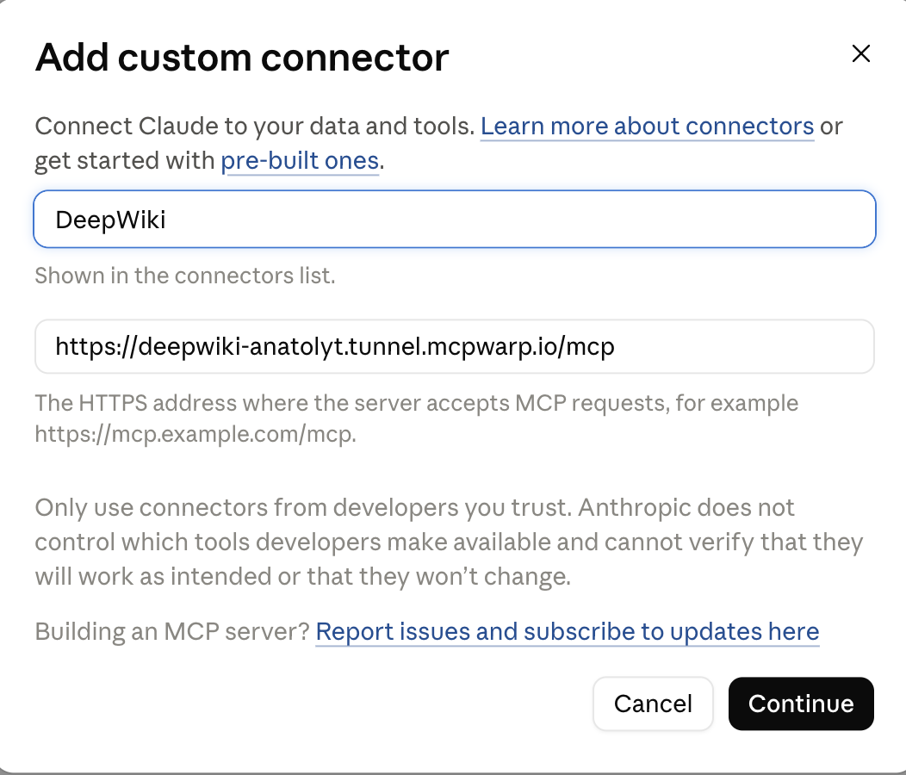
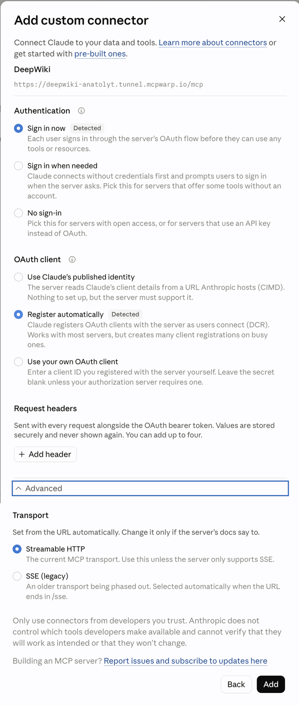
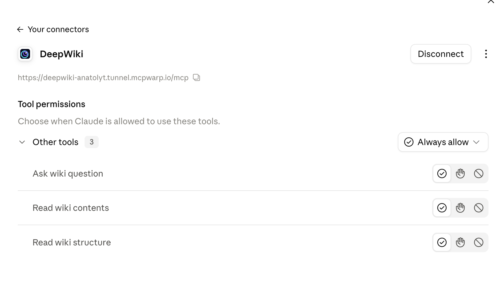

**Once `mcpwarp up` prints a URL for your server, add it to Claude as a remote MCP server and complete the OAuth sign-in when prompted.**

## Why localhost doesn't work

When you add a custom connector on claude.ai or in Claude Desktop, Claude calls your server from Anthropic's servers, not from your computer. Those servers can't reach your machine, so Claude rejects `http://localhost` URLs. MCP Warp gives your local server a public HTTPS URL that Anthropic's servers can reach. See Anthropic's [custom connectors guide](https://support.claude.com/en/articles/11175166-get-started-with-custom-connectors-using-remote-mcp).

## claude.ai (web) and Claude Desktop

Add a custom connector / remote MCP server and paste the URL from your `mcpwarp up` table. Complete the OAuth sign-in when prompted — this is the standard MCP OAuth flow, and it authorizes that specific Claude account against that specific server.

On claude.ai, the Add custom connector dialog first asks for a name and your server's `*.tunnel.mcpwarp.io/mcp` URL:



After Continue, claude.ai detects OAuth and dynamic client registration from the URL, so "Sign in now" and "Register automatically" are already selected; keep them and click Add:



Once you finish the OAuth sign-in, the connector page shows your MCP Warp URL and the server's tools, each with its own permission setting:



## Claude mobile app

Connectors you add on claude.ai or in Claude Desktop are available in Claude for iOS and Android the next time you sign in there, according to Anthropic's [connectors guide](https://support.claude.com/en/articles/11176164-use-connectors-to-extend-claude-s-capabilities). Add your MCP Warp URL on the web first, then use it from your phone.

## Claude Code

Use `claude mcp add` with the HTTP transport:

```sh
claude mcp add --transport http <name> <url>
```

For example:

```sh
claude mcp add --transport http notes https://notes-anatoly.tunnel.mcpwarp.io/mcp
```

Then authenticate: run `/mcp` inside a Claude Code session and pick the server, or run `claude mcp login notes` from your shell. Either one starts the OAuth sign-in.

MCP Warp isn't certified by Anthropic — it's built to work with Claude (claude.ai, Claude Desktop, Claude Code) as a standard Streamable HTTP MCP client.
